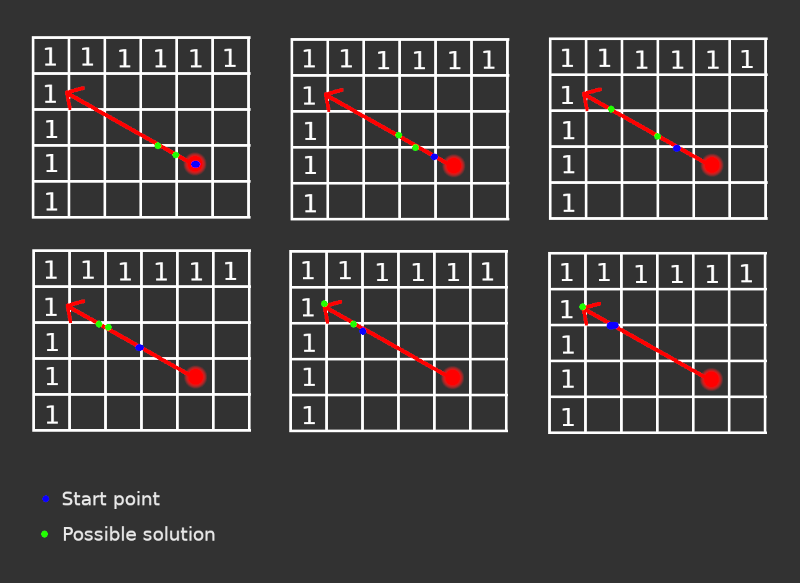

<div align="center">

<strong>Cub3D 🎮</strong>

<p>Cub3D is a project inspired by Wolfenstein 3D, one of the first first-person shooter games. It allows you to explore ray-casting techniques to create a 3D maze representation. The goal is to navigate through this environment while respecting the constraints of the graphic engine.</p>

</br>


<p><a href="https://github.com/MathysCogne/42_Cub3D/blob/main/subject/fr.subject.pdf"><strong>Subject</strong></a></p>

</div>

## Features

- 3D rendering using ray-casting

- Custom textures and configurable map

- Player movement and interactions

- Minimap display (bonus)

- Animated sprites (bonus)

- Door system (bonus)

- 360-degree full viewpoint management  (bonus)

- Mouse interaction for precise aiming and camera control (bonus)

- Weapon, and stats player (Heath, stamina..) (bonus)

</br>


## Controls

| Key     | Description       |
|:--------|:-------------------
| ESC        | Quit the game  |
| W/A/S/D     | Move         |
| ⬆️ / ⬇️     | Tilt the camera vertically      |
| ⬅️ / ➡️      | Rotate the camera horizontally      |
| Mouse movement     | Adjust camera viewpoint     |
| Left Mouse Click     | Shoot weapon     |
| Right Mouse Click     | Interaction weapon     |


</br>

## Map  `(.cub format)`

```
NO ./assets/texture/NO.xpm
SO ./assets/texture/SO.xpm
WE ./assets/texture/WE.xpm
EA ./assets/texture/EA.xpm

F ./assets/texture/BOT.xpm
C ./assets/texture/TOP.xpm

11111111111111111111111111
1E000000020000000000900001
19111111191111111110111191
10000000001000000010001001
11121110111011119111001021
10001000000010000000201001
10191101110101111191111221
10002001000100000000200001
11111101111101111111111111
11111111111191111111111111
     10000000000001
     10000200020001
     10000003000001
     10000000000001
11111111111111111111111111
```


## Compilation and Usage

</br>

```bash
# Compile:
make

# Start game:
./cub3d [path_map]
```

</br>


⊹ ࣪ ﹏𓊝﹏𓂁﹏⊹ ࣪ ˖

</br>

## RayCasting
This guide explains the logic behind ray casting for rendering a 3D-like environment using a 2D map.</br>

- 1/ Rays & Field of View (FOV)

If the player has a 90° field of view (FOV) and is looking straight north (90°, depending on your implementation), then the rays will cover an angular range from 90° - 45° to 90° + 45°.

If you cast 90 rays, each one corresponds to a specific angle in this range:
Angles: 45°, 46°, 47°, ..., 134°, 135°

Each ray is traced independently to detect walls and compute a color.
- 2/ Calculating Ray Vectors

To compute the movement vector for each ray, use trigonometry:

    X displacement:
    dx=cos(angle_h​)
    Y displacement:
    dy=sin(angle_h​)

with angle_h the angle of the ray.

For example, if the player is looking straight north (90°), then, for the mid ray:

    dx=cos⁡(90°)=0
    dy=sin⁡(90°)=1

This means the ray moves vertically upwards on the 2D grid (y -= 1, x += 0).  

Proportionality Calculations:

To find the movement needed to reach the next X or Y intersection, use the cross-multiplication rule:  
Case 1: Moving x_len on the X-axis, how much do we move in Y?  
y_len = sin(angle_h) * x_len / cos(angle_h)
or more classic cross factor view :  
cos(angle_h) | x_len  
sin(angle_h) | y_len  


Case 2: Moving y_len on the Y-axis, how much do we move in X?  
x_len = cos(angle_h) * y_len / sin(angle_h)
or more classic cross factor view :  
cos(angle_h) | x_len  
sin(angle_h) | y_len  

These formulas allow us to step through the grid along the ray's direction.
- 3/ Wall Detection (Grid Intersection Check)



Remember, we are looking for a wall (1 on our map).  
We start at the player's position, here x(4.5), y(3.5).  
You can see the ray angle (something like 30°, though it's not important).  
The first two intersections with rounded x and y values are shown in green.  
The y-axis intersection is at x(4.0).  
The x-axis intersection is at y(3.0).  

Which one is the closest?  
```
dist_x = (4.0 - 4.5) / cos(angle_h)  
dist_y = (3 - 3.5) / sin(angle_h)  
```

Compare dist_x and dist_y. Choose the smaller value as the next ray step.  
if it is dist_x, cross factor the y value.  
if it is dist_y, cross factor the x value.  

Then, verify if a wall is hit: 
```
case1 if the rounded value is x:   
grid[(int)y][(int)x−1]==1  
case2 if the rounded value is y:   
grid[(int)y - 1][(int)x]==1  
```

Repeat until this condition is met. I demonstrated the algo for the step1, i'm sure you can expend it yourself for each step  

As a result, we obtain the pixel offset of the image as a percentage. A value x (between 0 and 1) corresponding to the img column offset.  
On the map, the offset is something like 0.50. If your img is 200\*200, so it is the column 100 that you will have to render (200\*0.5).

- 5/ You still can't understand... look at the code

So far, you can only get a column offset, you can't get a single one pixel. You have 2 choices. The first one is to create a function to render the column. The other one is to continue on this logic and introduce a z axis. This is our choice, computing each pixel using raycasting.  
So, this demonstration is a simplified version of the algo, to make it work, you should introduce the z axis (height). We want to keep this text simple. Please look at the code to understand how to introduce the z axis.  
Helper: z vector correction: sin(angle_v);

- 6/ I'm still lost

You should use:  
cos, sin, ceil, floor, round, pi. You should understand that cos and sin create a vector (https://www.mathsisfun.com/algebra/trig-interactive-unit-circle.html), you should do your (very simple) math. Even if it is very simple. It took me 4 days. Don't panic.  
Code entry for raycasting : /src/exec/ray_casting/ray_casting.c

## Disclaimer
> At 42 School, most projects must comply with the [Norm](https://github.com/42School/norminette/blob/master/pdf/en.norm.pdf).

